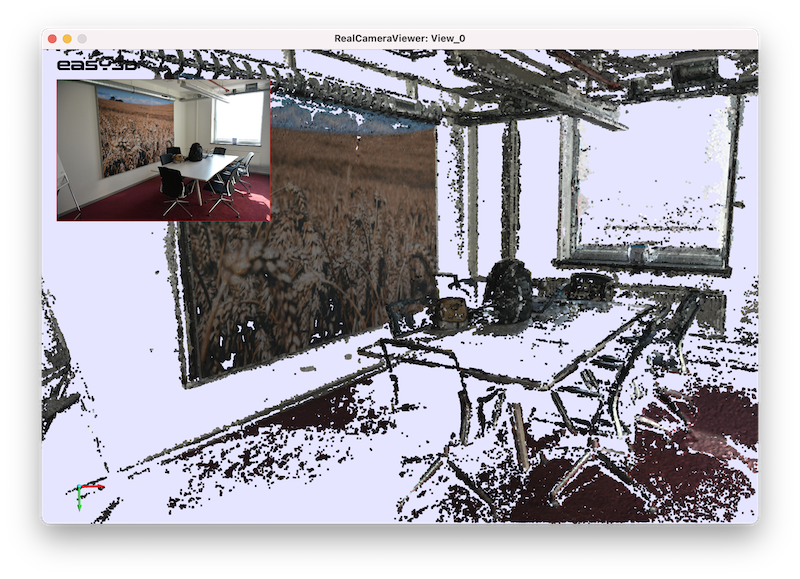

# Visualizing 3D data with calibrated cameras

|              view 00        |           view 03          |           view 11          |
|-----------------------------|----------------------------|----------------------------|
|   |  |  |

## How to build it:
 - Grab the source code of [Easy3D](https://github.com/LiangliangNan/Easy3D) and build it.
 - Point `Easy3D_DIR` to your build directory of Easy3D when doing cmake.
 - Build and run.